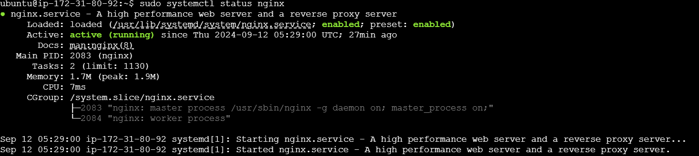

# Steps to install 3-tier application
## React-NodeAPI-Mysql
### Update server
```
 sudo apt-get update
  ```

### Step up nginx 
```
sudo apt install nginx 
Systemctl enable nginx
systemctl status nginx
```
  

### Clone app in nginx dub

```
cd \var\www
```
* clone app
  
  ```
  git clone http\\app path
  ```
  
### Database MSQL
* Step : 1 Install MYSQL in server
```
sudo apt install mysql-server
sudo mysql_secure_installation

sudo systemctl start mysql
sudo systemctl enable mysql
   ```
* Step : 2 Acess MYSQL
 
  ```
  sudo MYSQL
  ```
  
  *Extra Security-Step*
  
  *If you wann create a user and password for the localhost to enter MYSQL database*

  ```
  sudo mysql
  USE mysql;
  ALTER USER 'root'@'localhost'IDENTIFIED WITH mysql_native_password BY'your_new_password';
  FLUSH PRIVILEGES;
  exit
  sudo mysql -u root -p
  ```
* Step : 3 Creating database
  ```
  create database `devops-db`;
  ```
* Step : 4 Creating a user who have all access to the Database
  ```
  CREATE USER 'devops-user'@'%' IDENTIFIED BY 'qwe123!@#QWE';
  GRANT ALL PRIVILEGES ON `devops-db`.* TO 'devops-user'@'%';
  ```
* Step 5 create tables or import from .sql file
  ```
  use devops-db;

  CREATE TABLE users (
  id int(255) NOT NULL,
  name varchar(255) COLLATE utf8mb4_unicode_ci NOT NULL,
  email varchar(255) COLLATE utf8mb4_unicode_ci NOT NULL,
  work varchar(255) COLLATE utf8mb4_unicode_ci NOT NULL
  ) ; 
  ```
   **Or Import form file .sql**
   ``` 
   sudo mysql -u root -p devops-db < users.sql
   ```

* *tid bid*
  
  *show command is use to table and database in SQL*
```
Show databases;
show table; 
```
   *to exist MYSQL  use* **exit** *key word*.
### Install NodeJS | NPM 
*Before start working on app install all packages on the server*
```
curl -o- https://raw.githubusercontent.com/nvm-sh/nvm/v0.39.3/install.sh | bash
source ~/.bashrc
nvm install 18


curl -fsSL https://deb.nodesource.com/setup_18.x | sudo -E bash -
sudo apt-get install -y nodejs


```

### BACKEND

* Step : 1  install npm 
  
  ``` 
  cd /backend
  sudo npm i
  ```
*after npm i you get **node_modules** file*.

 
* Step : 2 Configure database in index.js file

    

* Step : 3 sudo npm run start 
  
     ```
       sudo npm run  star 
     ```
   *result*

   

* Step:4 for keep runing with the help of porgram manager
  
  ``` 
  sudo pm2 start npm --name "my-backend" -- run start
  ```
  *if the pm2 not working run command*
   ```
   npm install pm2@latest -g
   ```
   *extra important command for pm2*

   ```
   pm2 logs 

   pm2 list  
   ```


### Front End

* Step 1 : Configure back end path in .env file 
  
  ```
  http://server-ip:9001
  ```
* Step 2 : Install sudo npm i

  ```
  sudo npm install

  sudo npm run start
  ```

* *Extra Step  : Run pm2*

  ```
    pm2 start npm --name "my-frontend" -- run dev -- --port 5173
  ```
* Step 3 : Now building frontend , it will give dist folder
  ```
  npm  run build
  ```
### Nginx Configuration

* Step 1 : Copy dist folder to /var/www/devops/frontend
  
  ```
  cd /var/www
  sudo mkdir devops
  cd devops
  sudo mkdir frontend
  cd /homoe/ubuntu/React-NodeAPI-MySQL/frontend/
  sudo cp -rf ./dist /var/www/devops/frontend
  cd /var/www/devops/frontend
  ls
  ```
* Step 2 : Configure nginx revesrse Proxy
  > sudo nano /etc/nginx/sites-available/devops.config
  
  *Configure policy for nginx file*
  ```
   server {
    listen 80;
    server_name 54.82.14.15;  

    root /var/www/devops/frontend/dist;
    index index.html;

    location / {
        try_files $uri /index.html;
    }
  }
  ```
  *in image port is on 90 but best approch is to use 80 because default port of nginx is Port : 80*

  
* Step 3:   move files from site-availble to site-enable
  ```
  sudo ln -s /etc/nginx/sites-available/devops /etc/nginx/sites-enabled/devops

* Step: 4 Restart nginx
  
  *restart nginx with every change you make*
  ```
  sudo systemctl restart nginx
  ```
